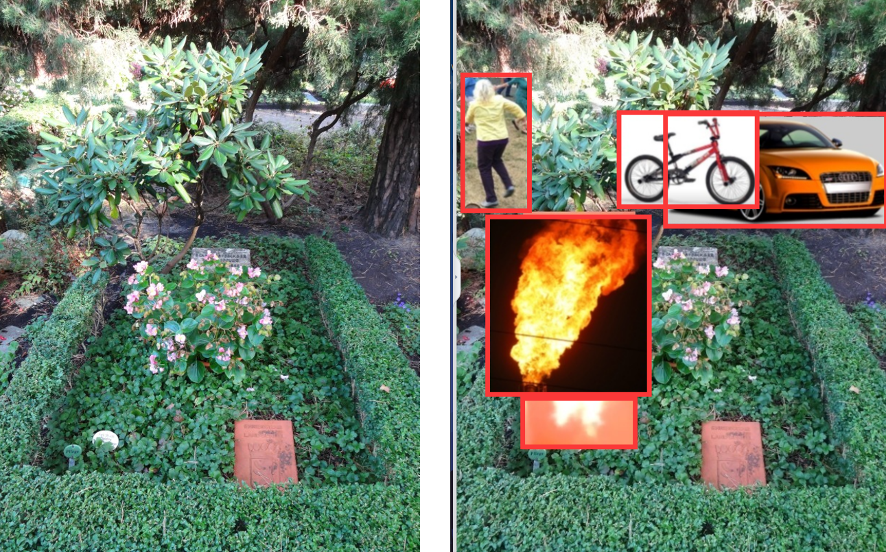
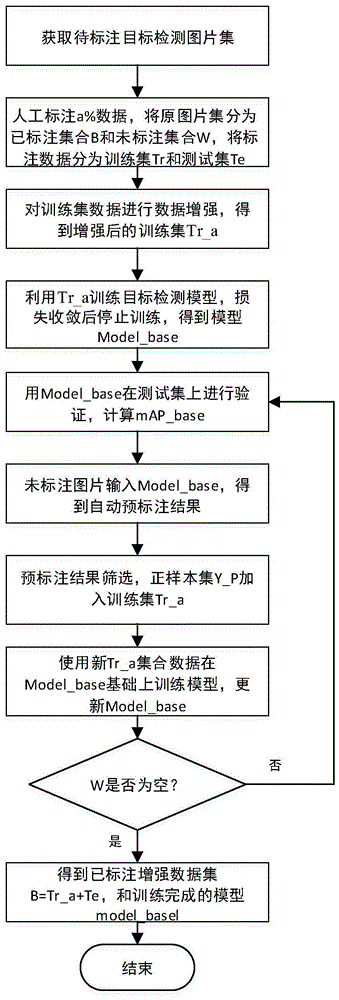

使用流程：

## （0）数据拍摄采集（可选）

`dataCollect`为数据采集而生。

> 默认情况采集的图片满足图片分类任务，更可以延申到目标检测和物体分割等图像数据的采集中！

## （1）数据初始化

这里我们将拍摄好的分类的数据统一复制或者剪切到放入到`datasets/JPEGImages`中。如果数据图像的名称杂乱，可以使用`tools/rename.bat`工具（双击即可）

对于`rename.bat`中命名方式的修改（`rename.bat第3行`）：
```html
命名从01开始，设置
set count=100

命名从0001开始，设置
set count=10000

如果我们想要从038开始排序，可以将第三行代码：
set count=10037
```

更全面准确的数据集分析：`DataAnalysis.md`

## （2）数据大小重置（可选）

在yolov5的训练中通常不需要将数据的大小重置为同样的大小，如果有需要去重置图片大小。可以使用`imgResize`。

## （3）数据离线增强（可选）

`imgAug`单张或者批量数据增强工具。

> yolov5在模型训练阶段拥有大量的数据增强操作，离线数据增强可以忽略！

## （4）数据标注

通常我们需要的软件是`labelimg`软件，它是一个开源的可以允许目标检测标注的工具。在这里我还编译提供了`labelimg-plus`解决了原有`labelimg`路径中或者标签中含有中文报错的问题。

标注教程：[数据集制作（LabelImg工具讲解）](https://blog.csdn.net/shuiyixin/article/details/82623613)

> 如果你拿到了别人标注好的数据，而你又不确定标注是否正确，你可以：【1】利用labelimg重新做检查；【2】利用`tools/show_bbox.py`去查看标注效果。

## （5）标注不对应清除（可选）

标注完成后：
```html
datasets
    ├─Annotations
    └─JPEGImages
```

> 为了确保`Annotations`和`JPEGImages`数量对应，我们可以去用`tools/clear_xml_img.bat`

在`JPEGImages`中是数据图像文件；在`Annotations`是对应`JPEGImages`**一样数量** 的xml标注文件。

## （6）数据格式转化

1. 修改`tools/voc_to_yolo.py`第8行标签内容为`labelimg`的`data/predefined_classes.txt`中的**顺序** 标签。
2. 修改`tools/split_trainTestVal.py`第43行的`jpg`为你的图像数据格式，例如`png`。（如果你不希望这么做，你也可以在**（1）数据** 初始化之后利用`tools/trans_img_suffix.py`转化图像数据后缀）
3. 修改`tools/remove_all_data.py`的第61-69行，小数据建议：`copy`操作，大数据建议：`move`操作。
4. 执行`data_sorting.bat`。

> 注意：我们需要在`data`文件夹下新建一个`data.yaml`：

```yaml
train: ./dataset/train/images
val: ./dataset/valid/images
test: ./dataset/test/images

nc: 5 # 修改你的物体类别数
names: ['bag','cup','key','phone','wallet'] # # 修改你的物体标签列表
```

## （7）数据图像扩充（可选）

`mixImg`项目为数据增广的优秀方式，最适合小目标扩增。

- https://github.com/aleju/imgaug
- https://github.com/gmayday1997/SmallObjectAugmentation
- https://github.com/kangpeilun/SmallObjectAugmentation-master
- https://github.com/obss/sahi



## （8）半自动标注（可选）

`autoLabel`半自动标注工具，加速标注。

